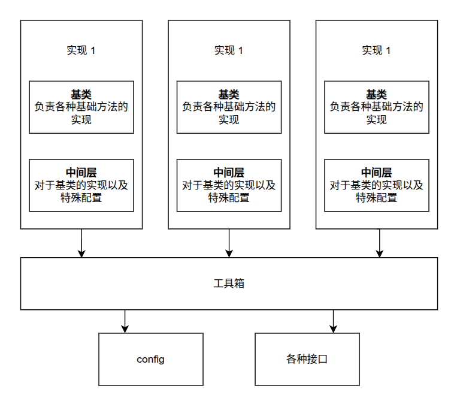

- 本文件是毕业设计时候的项目设计经验记录：
*** 
一般来说我们的项目分为多层：

1. 最里面的基类，这一部分需要非常深的抽象，提供各种接口出来，比如这里的buffer

2. 中间层的继承+实现，这一部分需要通过继承基类实现一些特定的功能，但是这种特定功能应该尽量依赖于基类方法，而不是独创新的方法，也就是说中间层偏config而不是一个新的类，比如PPO和SAC不同的buffer

3. 下层的工具箱，这一部分主要是提供接口给中间层的那些实现

4. 最外侧的接口，比如train，eval这种，需要通过名字+基类索引到中间层的具体实现，并且尽量通过基类提供的方法进行操作

具体框图可以参考：

*** 
# 问题记录

### 算法问题

1. value 使用标准化还是归一化

2. reward设计，差分、直接、log、势能函数、

### restrict增加

1. 回复客观、真实、简洁（包括各个文档内容），请按照科研者的要求约束自己

2. 不要重复之前上下文的假设，比如我们之前可能讨论过这里用不用symlog，但实际上没使用，那么就不要使用类似“不是symlog，不是...，而是...”的语式，每一个回复应保持有时效性

3. 在plan里面需要展示：1.改动主要思想；2.改动的具体文件并综述改动内容；3.改动后的数据流动过程，请严格按照**格式...**输出；4.还需要交流的改动细节（请深挖细节，主要是会影响模型稳定和优良性的一些细节trick等）

4. 改动后的restrict：提供一个简单文件具体讲解改动的内容、细节（review功能？）

# 隐秘

我们的毕设论文故事这么讲：

1. env：pybullet+机械臂assets（参数需要设计一下，尺度*10）四自由度+岩壁环境设置

2. 算法：PPO（后续增加SAC）+课程学习+迭代训练+碰撞检测+归一化稳定性处理，观测空间，动作空间，planner可达性检查湿喷点规划

3. buffer设计，offline2Online

4. 工况：传感器高斯噪声，末端突然受力（直接采样3个随机数）

5. 结果：成功收敛到0.003以内

# 过程记录

从我们拿到这个项目开始，我们先后做了这样一些事情，进行简单记录

## Version 1

- 我们创建了岩壁的数字环境（半圆柱体+柏林噪声+切向重力流动）

- 使用了planner创建随机湿喷起点终点，并利用局部法向投影到机械臂轨迹

- 然后我们使用直接的末端控制，分别尝试了PPO、SAC，末端的动力学约束直接通过控制步长达成

- 我们发现PPO、SAC都无法直接收敛，本质原因是采样空间相比于目标空间太大，于是我们考虑一种warmup缩小采样空间的方案——捷径学习，我们设定一系列目标来推动学习，这种方案最终能够收敛到0.006（100%成功），继续缩小目标在0.003也可以有60%成功率

## Version 2

- 在第一版的基础上，我们引入了一个pybullet环境，并且将末端控制变成了关节控制

- 关节控制的难度激增，原本能够收敛的0.1、0.2等目标此时都很难收敛，我们此时调节了参数完全对齐到SB3，并且我们切换了一种reward——通过log缩放的distance，这种方案能够显著增大近距离的distance差异，让我们能够不再设定到达奖励，而完全采用这种奖励

- 针对这种奖励我们也处理好了数学问题，方便后续的论文使用

- 这种方案能够在0.1上比较好地收敛，但是训练实在太慢了

## Version 3

- 我们将会引入FlashSAC的方案，并且确立SAC为基本的baseline，对比组包括SAC、PPO等

- 我们希望能够一次性到达0.003，通过其他方法来缩小采样空间而不是人工成本很高的课程学习

- 我们引入了GPU并行（数据转化为张量进行计算）和CPU并行（进程并行+IPC）——效果不好回退了

- 余弦学习率调度